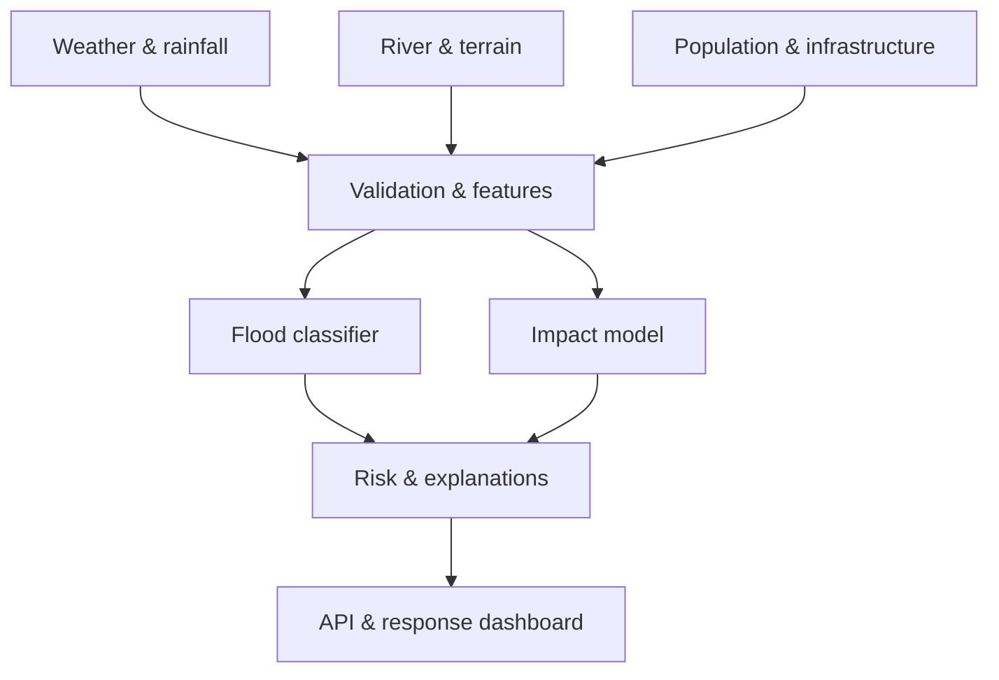

# Nepal–Odisha Flood & Extreme Weather Intelligence Platform

An end-to-end, decision-support data science project comparing flood risk in **Nepal** and **Odisha, India**. It combines weather, river, terrain, land-use and exposure signals to predict severe flooding, estimate impact, explain risk drivers and prioritize emergency response.

> **Safety:** This is a portfolio and research prototype—not an official warning system. Operational decisions must use alerts from Nepal DHM, India IMD/CWC, OSDMA and local authorities.

## Real scenario

Emergency teams have limited boats, shelters, medical teams and evacuation time. Nepal often faces steep-terrain flash floods and landslides; Odisha faces monsoon river flooding, low-lying coastal exposure and cyclone-related rainfall/storm surge. A single model can hide these differences, so this platform trains and evaluates regional models and audits their performance separately.

## What the AI does

1. Ingests weather, hydrology, terrain and population-exposure observations.
2. Builds leakage-safe rolling rainfall and river-anomaly features.
3. Predicts probability of a severe flood in the next 24 hours.
4. Estimates affected population and creates a response-priority score.
5. Explains each prediction and compares Nepal with Odisha.
6. Serves predictions through FastAPI and a Streamlit command dashboard.
7. Tracks model quality, regional fairness and feature drift.



## Technical scope

| Layer | Implementation |
|---|---|
| Data engineering | schema validation, reproducible synthetic scenario generator, API adapter interfaces |
| Analysis | regional EDA, imbalance checks, temporal rainfall and river features |
| ML | logistic baseline, random forest, gradient boosting, probability calibration-ready evaluation |
| Evaluation | PR-AUC, ROC-AUC, F1, recall, Brier score, region-level error analysis |
| Explainability | permutation importance and per-event risk-factor contribution |
| Decision science | population impact and configurable response-priority score |
| Serving | FastAPI `/predict`, `/health`, Streamlit dashboard |
| MLOps | saved model bundle, drift report, tests, Docker, GitHub Actions |

## Repository

```text
src/flood_ai/        data generation, features, training, inference, monitoring
api/main.py          prediction service
dashboard/app.py     incident command dashboard
scripts/             one-command pipeline
tests/               data and API tests
data/                 generated demo observations
models/               trained artifacts and metrics
```

## Run locally

```bash
python -m venv .venv
source .venv/bin/activate
pip install -r requirements.txt
python scripts/run_pipeline.py
uvicorn api.main:app --reload
streamlit run dashboard/app.py
```

Run tests with `pytest -q`. Build the container with `docker build -t flood-ai .`.

## Input features

`rainfall_24h_mm`, `rainfall_72h_mm`, `river_level_m`, `river_danger_level_m`, `soil_moisture_pct`, `slope_deg`, `elevation_m`, `distance_to_river_km`, `cyclone_signal`, `population_density`, `vulnerable_population_pct`, `road_access_score`, `hospital_capacity`, region and season.

## Honest data strategy

The included generator creates **synthetic but physically plausible demo data**, clearly labeled as such, so anyone can reproduce the pipeline without API keys. For real deployment, replace the adapters with verified sources such as Nepal DHM, IMD/CWC, NASA GPM, Copernicus DEM/land cover, Sentinel-1 flood extent, WorldPop and OpenStreetMap. Never present demo metrics as real disaster-system performance.

## Modeling decisions

- Time-based train/test split prevents learning from the future.
- PR-AUC and recall are emphasized because severe floods are rare and missed warnings are costly.
- Regional metrics catch a model that works in Odisha but fails in Nepal, or vice versa.
- The priority score is transparent and configurable; it combines risk, exposure, vulnerability and access difficulty.
- Predictions include uncertainty and model limitations.

## Next production steps

- Add geospatial catchment joins and satellite-derived flood masks.
- Train on independently verified historical event labels.
- Add rainfall forecast ensembles and calibrated uncertainty intervals.
- Validate thresholds with disaster-management experts.
- Add PostGIS, orchestration, model registry and authenticated alert delivery.

## Resume bullet

Built an end-to-end flood intelligence platform comparing Nepal and Odisha, engineering weather, river, terrain and exposure features; evaluated region-specific rare-event classifiers with temporal validation; and served explainable 24-hour risk and emergency-priority predictions through FastAPI and Streamlit with testing, drift monitoring and Docker deployment.

## License

MIT. See [LICENSE](LICENSE).
